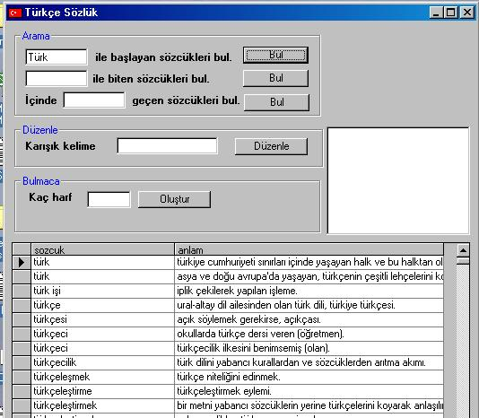



## Turkce Sozluk \- Turkish Dictionary

### Description

This is a Turkish-Turkish (meanings) dictionary. It has 85.000 words in an access database. You can use it in your applications.

(Sorry from Intl.Users but it's mainly for Turkish users of PSC)

Inspired from Stephen Whittle's crossword application, but it uses an access database and adodc instead of text file.
 
### More Info
 

             |
---                |---
**Submitted On**   |2004-09-13 16:04:08
**By**             |[suhan](https://github.com/Planet-Source-Code/PSCIndex/blob/master/ByAuthor/suhan.md)
**Level**          |Intermediate
**User Rating**    |3.7 (22 globes from 6 users)
**Compatibility**  |VB 6\.0
**Category**       |[Complete Applications](https://github.com/Planet-Source-Code/PSCIndex/blob/master/ByCategory/complete-applications__1-27.md)
**World**          |[Visual Basic](https://github.com/Planet-Source-Code/PSCIndex/blob/master/ByWorld/visual-basic.md)
**Archive File**   |[Türkçe\_Söz1792979132004\.zip](https://github.com/Planet-Source-Code/suhan-turkce-sozluk-turkish-dictionary__1-56160/archive/master.zip)

